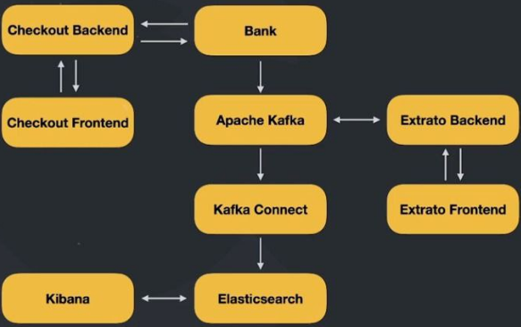

# Code Bank
Repositório contendo um exemplo de um sistema bancario criado durante a maratona Full Cycle 3.0.

## Dinâmica do Sistema

## TO DO
- Implementar transações de Commit e Rollback;
- Criptografar o número do cartão de crédito;
- Criar as tabelas automaticamente durante o build da imagem;